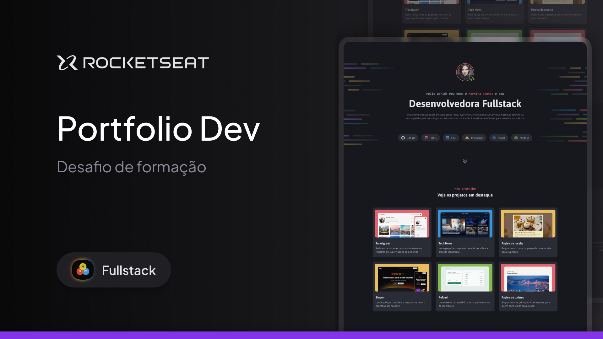

<<<<<<< HEAD

  

<h1 align="center"> Portfolio Dev </h1>

Programa exclusivo no curso Full-Stack, promovido pela Rocketseat para ensino de tecnologias WEB, no Modulo Avançando no HTML e CSS, realizado junto com intrutor, foi aplicado o Conceito GRID e Displey Flex do CSS nesse projeto foi realizado Desafio Pessoal para realização do Potfolio Dev.

  <a href="#-tecnologias">Tecnologias</a>&nbsp;&nbsp;&nbsp;|&nbsp;&nbsp;&nbsp;
  <a href="#-Projeto">Projeto</a>&nbsp;&nbsp;&nbsp;|&nbsp;&nbsp;&nbsp;
  <a href="#-layout">Layout</a>&nbsp;&nbsp;&nbsp;

 

  

## 🚀 Tecnologias

Esse projeto foi desenvolvido com as seguintes tecnologias:

- HTML e CSS
- Git e Github
- Figma

## 💻 Projeto

Voce pode visualizar o projeto pronto projeto através [DESSE LINK](https://ricardotavaresdias.github.io/PORTFOLIO-DEV/)
O Projeto Portal de Notícias é um agregador de ensino na Rocketseat para avançar o conhecimento em HTML e CSS. Nesse modulo foi aplicado o Conceito GRID e Displey Flex do CSS nesse projeto foi realizado Desafio Pessoal para realização do Potfolio Dev.

## 🔖 Layout

Você pode visualizar o layout do projeto através [DESSE LINK](https://www.figma.com/community/file/1387080701963671866). É necessário ter conta no [Figma](https://figma.com) para acessá-lo.

---

Rocketseat: [Participe da nossa comunidade!](https://www.rocketseat.com.br/)
=======

  

<h1 align="center"> Portfolio Dev </h1>

Programa exclusivo no curso Full-Stack, promovido pela Rocketseat para ensino de tecnologias WEB, no Modulo Avançando no HTML e CSS, realizado junto com intrutor, foi aplicado o Conceito GRID e Displey Flex do CSS nesse projeto foi realizado Desafio Pessoal para realização do Potfolio Dev.

  <a href="#-tecnologias">Tecnologias</a>&nbsp;&nbsp;&nbsp;|&nbsp;&nbsp;&nbsp;
  <a href="#-Projeto">Projeto</a>&nbsp;&nbsp;&nbsp;|&nbsp;&nbsp;&nbsp;
  <a href="#-layout">Layout</a>&nbsp;&nbsp;&nbsp;

 

  

## 🚀 Tecnologias

Esse projeto foi desenvolvido com as seguintes tecnologias:

- HTML e CSS
- Git e Github
- Figma

## 💻 Projeto

Voce pode visualizar o projeto pronto projeto através [DESSE LINK](https://ricardotavaresdias.github.io/PORTFOLIO-DEV/)
O Projeto Portal de Notícias é um agregador de ensino na Rocketseat para avançar o conhecimento em HTML e CSS. Nesse modulo foi aplicado o Conceito GRID e Displey Flex do CSS nesse projeto foi realizado Desafio Pessoal para realização do Potfolio Dev.

## 🔖 Layout

Você pode visualizar o layout do projeto através [DESSE LINK](https://www.figma.com/community/file/1387080701963671866). É necessário ter conta no [Figma](https://figma.com) para acessá-lo.

---

Rocketseat: [Participe da nossa comunidade!](https://www.rocketseat.com.br/)
>>>>>>> 4ef79fbbb998a31dd8f60efdd31fd8257d1a4a30
